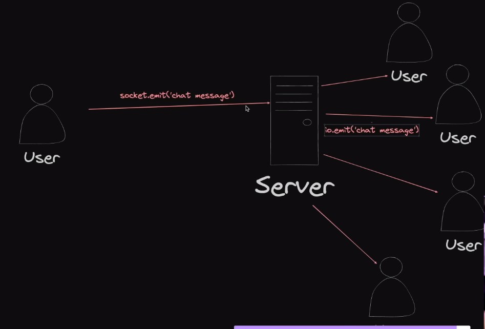
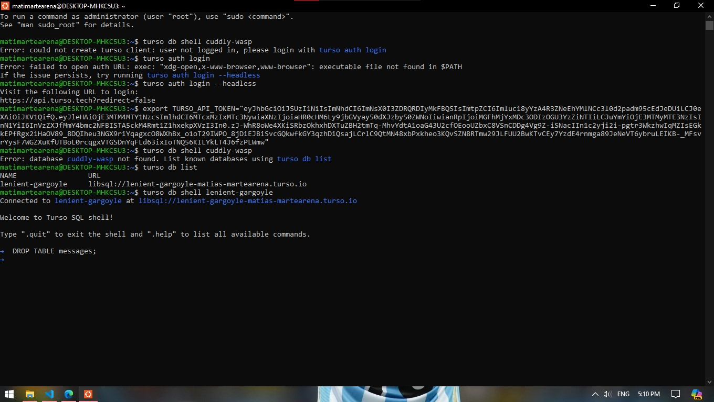

### Apuntes

1. Protocolos en internet:
   1. http vs web sockets
   2. http 2
   3. stateless y stateful
   4. cacheable y no cacheable
   5. Casos de uso
   6. Event driven
   7. Como funciona el protocolo HTTP
   8. Polling
   9. TCP
   10. Server events en HTTP
2. Dependencia Morgan
3. Dependencia ws para web sockets | Dependencia socket.io
4. Broadcast
5. Turso tech | Base de datos sql | Comandos para crear una base de datos con turso | Como ver los datos de la base en turso
6. Explicacion del proyecto

---

1. Protocolos en internet:
   
   **Introduccion a los protocolos de internet**

   Internet funciona gracias a un conjunto de reglas y estandares conocidos como protocolos de internet. Estos protoclos definen como los dispoitivos se comunican entre si, permitiendo que compartamos informacion, accedamos a sitios web y utilicemos diversos servicios en linea.

   **Que son los protocolos de red?**

   Un protocolo de red es un conjunto de relgas que establecen como los dispositivos se comunican entre si en una red. Estos protocolos definen aspectos como el formato de los datos, el metodo de transmision y la gestion de errores.

   **Como funcionan los protocolos de internet?**

   Los protocolos de internet se organizan en capas, cada una con funciones especificas. Las capas principales son:

   - Capa de enlace de datos: Se encarga de la transmision de datos entre dispositivos en la misma red local.
   - Capa de internet: Define el direccionamiento IP y el enrutamiento de datos a traves de diferentes redes.
   - Capa de transporte: Garantiza la entrada confiable de datos entre aplicaciones.
   - Capa de aplicacion: Define los protocolos especificos para diferentes servicios, como correo electronico, transferencia de archivos y navegacion web.
  
   **Cuales son algunos de los protocolos de internet mas importantes?**

   - TCP/IP (Transmission Control Protocol / Internet Protocol): El conjunto de protocolos fundamentales para la comunicacion en internet.
   - HTTP (Hypertext Transfer Protocol): El protocolo utilizado para la transferencia de paginas web.
   - FTP (File Transfer Protocol): El protocolo utilizado para la transferencia de archivos.
   - SMTP (Simple Mail Transfer Protocol): Utilizado para el envio de correos electronicos.
   - DNS (Domain Name System): El sistema que traduce nombres de dominio en direcciones IP.

   **Por que son importantes los protocolos de internet?**

   - Permiten la comunicacion entre dispositivos de diferentes fabricantes y sistemas operativos.
   - Definen estandares para la transmision de datos, garantizando la interoperabilidad.
   - Gestionan el enrutamiento de datos, asegurando que lleguen al destino correcto.
   - Controlan la entrega confiable de datos, envitando errores y perdidas. 

   1. http vs web sockets
   
   HTTP y WebSockets son dos protocolos de internet fundamentales, pero con propositos distintos:

   **HTTP (Hypertext Transfer Protocol):**

   - Se trata de un protocolo de solicitud-respuesta.
   - Funciona como la base para la comunicacion entre navegadores web y servidores web.
   - El navegador web inicia una solicitud al servidor para un recurso especifico (como una pagina web, imagen o archivo).
   - El servidor responde enviando el recurso solicitado.
   - La conexion se cierra una vez que se ha enviado la respuesta.
   - Es ideal para transferir contendo estatico como paginas web, imagenes y documentos.
   - No es adecuado para aplicaciones que requiren comunicacion en tiempo real bidireccional.

   **WebSockets:**

   - Es un protocolo de comunicacion bidireccional y de tiempo real.
   - Permite una conexion persistente entre el navegador web y el servidor.
   - Ambos, el cliente y el servidor, pueden enviar y recibir mensajes en cualquier momento.
   - Es ideal para aplicaciones que requieren actualizaciones constantes, como chats, juegos en linea, cotizaciones bursatiles y tableros colaborativos.
   - Consume menos recursos del servidor que las continuas solicitudes HTTP.
   
   2. http 2
   
   HTTP/2 es una mejora significativa del protocolo HTTP/1.1 que usamos habitualmente para navegar por la web. Su objetivo es optimizar la velocidad de carga de las paginas web.

   **Caracteristicas:**

   - Multiplexacion: A diferencia de HTTP/1.1 que abria una conexion por cada recurso solicitado, HTTP/2 permite enviar y recibir varios flujos de datos simultaneamente a traves de una unica conexion. Esto evita la congestion y mejora la velocidad de carga general.
   
   - Comprension de encabezados: Los encabezados de HTTP suelen ser voluminosos y contienen informacion de control. HTTP/2 comprime estos encabezados, reduciendo el tamaño de los datos que se tranfieren y mejorando la eficiencia.
   
   - Priorizacion: HTTP/2 permite priorizar la carga de elementos criticos de una pagina web. Por ejemplo, el navegador puede solicitar que se cargue primero el contenido principal y luego los elementos secundariso como imagenes y banners.
   
   - Server Push: Con HTTP/2, el servidor puede anticparse a las solicitudes del cliente y enviar proactivamente recursos que cree que necesitara, evitando asi un viaje de ida y vuelta para solicitarlos.

   **Ventajas**

   - Paginas web mas rapidas.
   - Menor latencia.
   - Menor consumo de recursos. 
 
   3. stateless y stateful
   
   **Protocolos Stateless (Sin estado):**

   - No guardan informacion sobre las conexiones previas entre cliente y servidor.
   - Cada peticion se trata como una transaccion independiente.
   - La informacion necesaria para procesar la peticion debe estar incluida en la propia peticion.
   - Son mas simples y rapidos de implementar.
   - Son escalables y funcionan bien en entornos con alto trafico.
   
   **Protocolos stateful (Con estado):**

   - Mantienen informacion sobre el estado de una conexion a lo largo de varias peticiones.
   - Utilizan esta informacion para procesar peticiones posteriores de manera mas eficiente.
   - Pueden ofrecer caracteristicas mas avanzadas como control de flujo y control de errores.
   - Son mas complejos de implementar y pueden ser menos escalables.

   **Ejemplos:**

   - Stateless:
     - HTTP
     - DNS
     - UDP
   - Stateful:
     - TCP
     - FTP
     - SSH

   4. cacheable y no cacheable
   
   Cacheable y no cacheable se refiere a la capacidad de almacenar contenido en la cache. La cache es un almacenamiento temporal en navegadores, servidores intermedios o dispositivos que guarda copias de recusos para un acceso mas rapido en el futuro.

   - Cacheable: Un recurso cacheable indica que se puede almacenar en la cache para su uso posterior. Esto significa que cuando un usuario solicita el recurso nuevamente, la cache puede recuperarlo localmente en lugar detener que solicitarlo nuevamente al servidor original. Esto mejora el rendimiento y reduce el trafico de red.
   
   - No cacheable: Un recurso no cacheable indica que no se debe almacenar en la cache. Cada vez que un usuario solicite el recurso, el navegador o cliente debera solicitarlo directamente al servidor original. Esto se suele utilizar para contenido que cambia con frecuencia, como paginas de inicio de sesion seguras o informacion financiera actualizada.

   5. Casos de uso
   
   **Casos de uso de protocolos HTTP y WebSockets**

   _HTTP_

   - Recuperacion de paginas web estaticas.
   - Transferencias de archivos.
   - Consultas API RESTful.
   - Aplicaciones web tradicionales.

   _WebSockets_

   - Aplicaciones de chat en tiempo real.
   - Juegos multijugador en linea.
   - Aplicaciones de colaboracion.
   - Paneles de control y actualizaciones en tiempo real.
   - Aplicaciones de streaming. 
   
   6. Event driven
   
   La arquitectura impulsada por evento (EDA, por sus siglas en ingles) es un patron de diseño de software que se centra en la produccion, deteccion, consumo y reaccion a eventos. Un evento puede entenderse como un cambio significativo de estado dentro de un sistema.

   Conceptos centrales:

   - Eventos: Son señales que indican que algo importante ha sucedido dentro del sistema. Los eventos pueden representar diversas cosas, como un usuario iniciando sesion, la compra de un producto o un sensor que lee un valor especifico.
   
   - Productores de eventos: Son los componentes responsables de generar eventos cuando ocurre algo notable. Esto podria ser cualquier parte del sistema, desde una interaccion del usuario hasta un proceso interno del sistema.
   
   - Canales de eventos: Son las vias a traves de las cuales se distribuyen los eventos a los consumidores interesados. Existen diversos sistemas de mensajeria y tecnologias utilizados como canales de eventos, como colas de mensajes o sistemas pub/sub.
   
   - Consumidores de eventos: Son los componentes que escuchan y reaccionan a eventos especificos. Los consumidores pueden ser diferentes partes de la misma aplicacion o incluso servicios en sistemas separados. Procesan los datos del evento y toman las acciones adecuadas.

   **Beneficios:**

   - Acoplamiento debil.
   - Escalabilidad.
   - Capacidad de respuesta.
   - Resiliencia.

   **Casos de uso:**

   - Arquitectura de microservicios.
   - Aplicaciones en tiempo real.
   - Procesos de datos.
   - Sistemas loT.  
   
   7. Como funciona el protocolo HTTP
   
   El protocolo HTTP es la base de la comunicaion en la WWW. Es un protocolo sin estado, basado en texto y que sigue un esquema de peticion-respuesta entre un cliente y un servidor.

   **Funcionamiento basico:**

   - Solicitud del cliente: El usuario escribe una direccion web en su navegador. El navegador envia una solicitud HTTP al servidor web correspondiente. ESta solicitud contiene informacion como el metodo HTTP (GET, POST, etc), la URL del recurso solicitado y los encabezados HTTP con informacion adicional.
   
   - Respuesta del servidor: El servidor web recibe la solicitud y la procesa. Si la solicitud es valida y el recurso existe, el servidor envia una respuesta HTTP al cliente. La respuesta contiene el codigo de estado HTTP (indicando exito o error), los encabezados HTTP con informacion sobre el recurso y el cuerpo de la respuesat que puede ser el contenido HTML de una pagina web, una imagen, etc.
   
   - Recepcion de la respuesta: El navegador recibe la respuesta HTTP del servidor y la interpreta. Si la respuesta es exitosa (200), el navegador muestra el contenido de la pagina web o procesa el archivo descargado, segun el tipo de recurso. Si la respuesta indica un error (404, 500, etc), el navegador muestra un mensaje de error correspondiente.
   
   **Caracteristicas:**

   - Sin estado.
   - Basado en texto.
   - Peticion-respuesta.
   - Versatil.
   - Extensible.

   **Metodos comunes**

   - GET
   - POST
   - PUT
   - DELETE 

   8. Polling
   
   El polling o sondeo informatico se refiere a una operacion de consulta constante realizada por un programa cliente hacia un dispositivo o recurso externo para verificar si hay actualizaciones o cambios en su estado. Se trata de una tecnica sincrona, lo que significa que el cliente detiene su ejecucion hasta que recibe una respuesta del dispositivo o recurso sondeado.

   **Funcionamiento:**

   - Inicio de la consulta.
   - Espera de respuesta.
   - Procesamiento de la respuesta.
   - Accion basada en la respuesta.
   
   **Tipos de polling:**

   - Polling basado en tiempo.
   - Polling basado en eventos.

   **Ventajas del polling:**

   - Simpleza.
   - Flexibilidad.
   - Funcionamiento sin conexion.

   **Desventajas del polling:**

   - Consumo de recursos.
   - Latencia.
   - Inescalabilidad.

   **Aplicaciones del polling:**

   - Monitoreo de sistemas.
   - Actualizaciones de software.
   - Sincronizacion de datos.
   - Entrada/salida por software.  

   9. TCP
   
   El protocolo de control de transmicion (TCP) es un protocolo fundamental en la red que garantiza la transmicion confiable de datos entre dispositivos conectados a una red como internet. Funciona en la capa de transporte del modelo OSI, que se encarga de proporcionar servicios de comunicacion orientados a la conexion entre aplicaciones en red.

   **Aspectos clave:**

   - Flexibilidad: A diferencia de otros protocolos como UDC, TCP se asegura que los datos lleguen a su destino sin errores, en el orden correcto y completos. Logra esto dividiendo los datos del mensaje original en segmentos mas pequeños y manejables. Luego, añade informacion de control a cada segmento, incluyendo un numero de secuencia para ordenarlos y codigos de verificaion de errores para detectar corrupcion durante la transmicion.
   
   - Conexion orientada: TCP establece una conexion virtual entre el dispositivo emisor y el recepto antes de comenzar la transmision de datos. Este conexion permite el control del flujo de datos y la retransmicion de segmentos perdidos o dañados.
   
   - Control de flujo: TCP utiliza un mecanismo de control de flujo para evitar que el emisor envie datos a una velocidad mayor de la que el receptor puede procesar. Esto evita la sobrecarga del receptor y garantiza una transmision fluida.
   
   - Control de congestion: Las redes informaticas tienen una capacidad limitada para transmitir datos. TCP implementa mecanismos de control de congestion para evitar colapsar la red. Estos mecanismos ajustan la velocidad de transmicion de datos en funcion de la congestion de la red.
   
   **Resumen del funcionamiento de TCP:**

   - Establecimiento de la conexion.
   - Transmicion de datos.
   - Acuse de recibe.
   - Control de flujo.
   - Control de congestion.
   - Cierre de la conexion.

   **Beneficios del protocolo TCP:**

   - Fiabilidad: Garantiza la entrega confiable de datos sin errores.
   - Orden: Asegura que los datos lleguen al receptor en el orden correcto.
   - Control de flujo: Evita la sobrecarga del receptor.
   - Control de congestion: Ayuda a mantener el buen funcionamiento de la red.

   **Aplicaciones del protocolo TCP:**

   - Tranferencia de archivos.
   - Correo electronico.
   - Navegacion web.
   - Servicios de streaming.

   10. Server events en HTTP

   Los eventos del servidor en HTTP son una tecnica para lograr comunicaion unidireccional del servidor al cliente, permitiendo al servidor enviar actualizaciones en tiempo real al navegador del cliente sin necesidad de que el cliente solicite explicitamente esos cambios.

   **Funcionamiento:**

   - Establecimiento de la conexion: EL navegador del cliente establece uan conexion HTTP persistente con el servidor utilizando una URL especifica para los eventos.
   
   - Apertura del EventSource: El cliente crea un objeto EventSourc utilizando la URL del servidor de eventos.
   
   - Envio de eventos: El servidor envia eventos al cliente como texto plano separado por lineas nuevas (\n). Cada evento puede incluir datos adicionales como el tipo de evento y el contendo del evento.
   
   - Recepcion de eventos: El navegador recibe los eventos del serivdor y los procesa mediante eventos JavaScript como onmessage. EL cliente puede reaccionar y actualizar su interfaz de usuario en funcion de los datos del evento recibido.
   
   - Cierre de la conexion: El cliente o el servidor pueden cerrar la conexion en cualquier momento. El cliente puede cerrar la conexion llamando al metodo close() del objeto EventSource. El servidor puede indicar el cierre enviando un evento especial o simplemente cerrando la conexion.

   **Ventajas**

   - Comunicacion en tiempo real.
   - Simpleza.
   - Bajo consumo de recursos.
   - Flexibilidad.

   **Desventajas**

   - Soporte del navegador.
   - Conexiones persistentes.
   - Latencia.

   **Aplicaciones de los eventos del servidor:**

   - Actualizaciones de chat.
   - Paneles de control.
   - Aplicaciones de colaboracion.
   - Notificaciones. 

--- 

2. Dependencia Morgan

   El modulo morgan es un middleware popular de codigo abierto utilizado para registrar informacion sobre las solicitudes HTTP que llegan a un servidor Node.js, especialmente en aplicaciones desarrolladas con el framework Express.js. Funciona como una capa intermedia en el flujo de peticiones HTTP, interceptando las solicitudes antes de que lleguen a los controladores de la aplicacion y generando registros personalizados basados en la configuracion.

   **Caracteristicas:**

   - Registro detallado: Morgan proporciona informacion valiosa sobre cada solicitud HTTP, incluyendo:
     - Metodo
     - URL solicitada
     - Estado de la respuesta
     - Tamaño de la respuesta
     - Tiempo de respuesta
     - Direccion IP del cliente
     - User-agent del navegador del cliente
     - Y otros datos personalizables

   - Formatos predefinidos: Ofrece varios foramtos para los registros como "common", "combined", "dev", "short" y "tiny".
   
   - Formato personalizado: Tambien permite definir formatos de registro personalizados para incluir informacion especifica de tu aplicacion.
   
   - Steam de salida flexible: Los registros generados por Morgan se pueden escribir en diferentes flujos de salida, como la consola, un archivo de texto o un servicio de registro remoto.

   **Beneficios:**

   - Depuracion.
   - Analisis de trafico.
   - Monitoreo del rendimiento. 

   **Uso**

   ```console
   npm install morgan
   ```

   ```js
   import express from 'express'
   import morgan from 'morgan' 

   const app = express()

   app.use('dev')
   ```

---

3. Dependencia ws para web sockets | Dependencia socket.io

   El modulo ws es una libreria para implementar servidores y clientes WebSockets en Node.js. Proporciona una API simple y eficiente para crear conexiones bidireccionales de comunicacion en tiempo real entre servidores y clientes web.

   **Caracteristicas:**

   - Servidores y clientes webSockets.
   - Mensajes de texto y binarios.
   - Eventos y callbacks.
   - Ping y pong.
   - URL de origen restringido.
  
   **Uso:**

   ```js
   // Servidor WebSocket
   import WebSocket from 'ws'

   const wss = new WebSocket.Server({ port: 8080 })

   wss.on('connection', (ws) => {
      console.log('Cliente conectado')

      ws.on('message', (message) => {
         console.log('Mensaje recibido:', message.toString())
         ws.send('Mensaje recibido del servidor')
      })

      ws.on('close', () => {
         console.log('Cliente desconectado')
      })
   })
   ```

   Este codigo crea un servidor WebSocket en el puerto 8080. Cuando un cliente se conecta, el servidor registra el evento, procesa los mensajes entrantes del cliente enviando una respuesta y maneja el cierre de la conexion.

   ```js
   // Cliente WebSocket
   import WebSocket from 'ws'

   const wss = new WebSocket('ws://locahost:8080')

   ws.onopen = () => {
      console.log('Conectado al servidor')
      ws.send('Hola desde el cliente')
   }

   ws.onmessage = (event) => {
      console.log('Mensaje del servidor:', event.data.toString())
   } 

   ws.onclose = () => {
      console.log('Desconectado del servidor')
   }
   ```

   Este codigo crea un cliente WebSocket que se conecta al servidor en ejecucion en localhost:8080. Envia un mensaje incial al servidor, recibe mensajes de respuesta y maneja los eventos de apertura y cierre de la conexion.
   
   **Modulo socket.io de node.js para WebSockets**

   _Caracteristicas:_

   - Basado en ws.
   - Salas (rooms).
   - Namespaces.
   - Eventos personalizados.
   - Emision (broadcasting).
   - Adaptadores.

   _Ventajas:_

   - Mayor abstraccion.
   - Salas y namespaces.
   - Eventos personalizados.
   - Adaptadores.

   _Desventajas:_

   - Depedendencia adicional.

   _Uso basico:_

   ```js
   import express from 'express'
   import { createServer } from 'node:http'
   import { io } from 'socket.io'
   
   const app = express()
   const server = createServer(app)
   const io = new Server(server)

  app.get('/', (req, res) => {
    res.sendFile(process.cwd() + '/client/index.html')
  })

  io.on('connection', (socket) => {
   console.log('Cliente conectado')

   socket.on('chat message', (msg) => {
      io.emit('chat message', msg)
   })

   socket.on('disconnect', () => {
      console.log('Cliente desconectado')
   })
  })

  const PORT = process.env.PORT ?? 3000

  server.listen(PORT, () => {
    console.log(`Server running on port: http://localhost:${PORT}`)
  })
  ```

  Este codigo crea un servidor socket.io que escucha en el puerto 3000. Se integra con Express para servir un archivo HTML basico. Cuando un cliente se conecta, el servidor registra el evento y escucha por mensajes personalizados como "chat message". Al recibir un mensaje, el servidor lo emite a todos los clientes conectados utilizando io.emit.

  ```html
  <!-- Cliente con socket.io -->
  <!DOCTYPE html>
  <html>
  <head>
    <title>Chat en tiempo real</title>
    <script src="https://cdnjs.cloudflare.com/ajax/libs/socket.io/4.5.0/socket.io.js"></script>
  </head>
  <body>
    <input type="text" id="message" placeholder="Mensaje">
    <button onclick="enviarMensaje()">Enviar</button>
    <script>
      const socket = io()

      function enviarMensaje() {
        const message = document.getElementById('message').value
        socket.emit('chat message', message)
        document.getElementById('message').value = ''
      }

      socket.on('chat message', (msg) => {
        console.log('Mensaje recibido:', msg)
      })
    </script>
  </body>
  </html>
  ```

   Este codigo HTML basico incluye el script socket.io y define funciones para enviar mensajes al servidor y procesar mensajes recibidos.

---

4. Broadcast

   

   **Broadcast: Definicion y funcionamiento**

   El termino se refiere a la transmision de informacion desde un punto central a multiples receptores de forma simultanea. Esta transmision puede realizarse a traves de diversos medios, como ondas de radio, television por cable, redes informaticas o señales de satelite.

   **Caracteristicas:**

   - Comunicacion unidireccional.
   - Llegada simultanea.
   - Alcance amplio.
   - Bajo costo por receptor.

   **Tipos**

   - Tradicional.
   - Por cable.
   - Por satelite.
   - IP.

   **Ejemplos**

   - Emision de radio y television.
   - Servicio de streaming.
   - Mensajeria instantanea.
   - Alertas de emergencia.

   **Ventajas**

   - Eficiencia.
   - Bajo costo.
   - Inmediatez.
   - Simplicidad.

   **Desventajas**

   - Falta de interactividad.
   - Falta de segmentacion.
   - Problemas de saturacion. 

---

5. Turso tech | Comandos para crear una base de datos con turso | Como ver los datos de la base en turso

   Para que turso funcione se debe instalar desde mac o desde una maquina virtual de linux.

   Tambien se deben instalar los paquetes:

   ```terminal
   npm install @libsql/client
   npm install dotenv
   ```

   // Pagina principal
   `https://turso.tech/`

   // Documentacion
   `https://docs.turso.tech/introduction`

   // Comando para acceder a la base de datos y borrar tablas
   

   // Comando para crear una base de datos en turso
   turso db create

   // Comando para ver los detalles de la base de datos
   turso db show nombre_de_la_base

   // Comando para conseguir el token de la db
   turso db tokens create nombre_de_la_base

   // Comando para autenticar el login
   turso auth signup
   turso auth login

   Si no funciona se debera poner el siguiente comando para autenticarlo por fuera

   turso auth signup --headless
   turso auth login --headless

   Para ver la base de datos y las tablas se debe de ingresar a la pagina, posteriormente hacer un inicio de sesion, y en el apartado de 'Databases' se podra ver un listado de las bases de datos. Hay un boton para ver las tablas y sus detalles.

---

6. Explicacion del proyecto

   ##Explicación del proyecto de chat en tiempo real con Node.js, Express, WebSockets y Turso

   Este proyecto implementa un chat en tiempo real utilizando las siguientes tecnologías:

   * **Servidor:**
      * Node.js: El entorno de ejecución del servidor.
      * Express: Un framework para crear aplicaciones web en Node.js.
      * Socket.IO: Librería para comunicación WebSocket bidireccional entre el servidor y los clientes.
      * Turso Tech: Para la base de datos SQLite embebida (limitada).
      * dotenv: Permite cargar variables de entorno desde un archivo `.env`.

   * **Cliente:**
      * JavaScript Vanilla: Utiliza código JavaScript sin frameworks adicionales.
      * Socket.IO: Cliente JavaScript para la comunicación WebSocket con el servidor.

   * **Base de datos:**
      * Turso Tech: Se utiliza una base de datos SQLite embebida para almacenar los mensajes del chat.  **Ten en cuenta que Turso no es ideal para despliegues en producción por su escalabilidad limitada.**

   ## Funcionamiento del servidor (index.js)

   1. **Importaciones y configuración:**
      * Se importan los módulos necesarios.
      * Se carga la configuración desde el archivo `.env` (se asume que contiene la variable `DB_TOKEN` para autenticarse en Turso).
   2. **Servidor y Socket.IO:**
      * Se crea una instancia de la aplicación Express y del servidor HTTP.
      * Se configura Socket.IO sobre el servidor HTTP.
      * Se habilita la recuperación del estado de la conexión (`connectionStateRecovery`).

   3. **Conexión a la base de datos:**
      * Se crea un cliente de Turso usando la URL y el token de autenticación.
      * Se ejecuta una consulta SQL para crear la tabla `messages` si no existe (esquema: id, content, user).

   4. **Evento 'connection' de Socket.IO:**
      * Se maneja la conexión de un nuevo cliente (`socket`).
      * Se obtiene el nombre de usuario del handshake de la conexión (si existe) o se asigna "Anonymous" por defecto.

   5. **Evento 'chat message' del cliente:**
      * Se recibe un mensaje de chat del cliente (`msg`).
      * Se inserta el mensaje en la base de datos usando una consulta preparada con `db.execute`.
      * Se emite el mensaje recibido (`msg`), el ID del mensaje insertado (`lastInsertRowid`) y el nombre de usuario (`username`) a todos los clientes conectados (`io.emit`).

   6. **Recuperación de mensajes perdidos:**
      * Si la conexión no se recuperó (`!socket.recovered`), se realiza una consulta para obtener mensajes nuevos desde el último offset conocido (`socket.handshake.auth.serverOffset`).
      * Se recorren los resultados y se emiten los mensajes al cliente junto con su contenido, ID y usuario.

   7. **Servidor web estático:**
      * Express sirve el archivo `index.html` desde la carpeta `client` para la interfaz del chat.

   8. **Inicio del servidor:**
      * El servidor escucha en el puerto especificado por la variable de entorno `PORT` o en el puerto 3000 por defecto.

   ## Funcionamiento del cliente (index.html)

   1. **Obtener nombre de usuario:**
      * Intenta recuperar el nombre de usuario almacenado en localStorage.
      * Si no existe, se obtiene un nombre aleatorio usando la API `https://random-data-api.com/api/users/random_user` y se guarda en localStorage para futuras conexiones.

   2. **Conexión a Socket.IO:**
      * Se crea una conexión a Socket.IO con el servidor, proporcionando el nombre de usuario obtenido y un offset inicial de 0 para la recuperación de mensajes perdidos.

   3. **Elementos del DOM:**
      * Se obtienen referencias a los elementos HTML del chat: lista de mensajes (`messages`), formulario (`form`), input de texto (`input`).

   4. **Evento 'chat message' del servidor:**
      * Se escucha el evento `chat message` emitido por el servidor.
      * Se reciben el mensaje (`msg`), el serverOffset y el nombre de usuario (`username`).
      * Se crea un elemento HTML para el mensaje con el contenido y el usuario.
      * Se agrega el nuevo mensaje a la lista (`messages`).
      * Se actualiza el offset del servidor (`socket.auth.serverOffset`).
      * Se hace scroll automático para mostrar el último mensaje.

   5. **Enviar mensaje:**
      * Se agrega un manejador de evento `submit` al formulario.
      * Al enviar el formulario, se obtiene el valor del input de texto (`input.value`).
      * Si el valor del mensaje no está vacío, se emite el mensaje

---